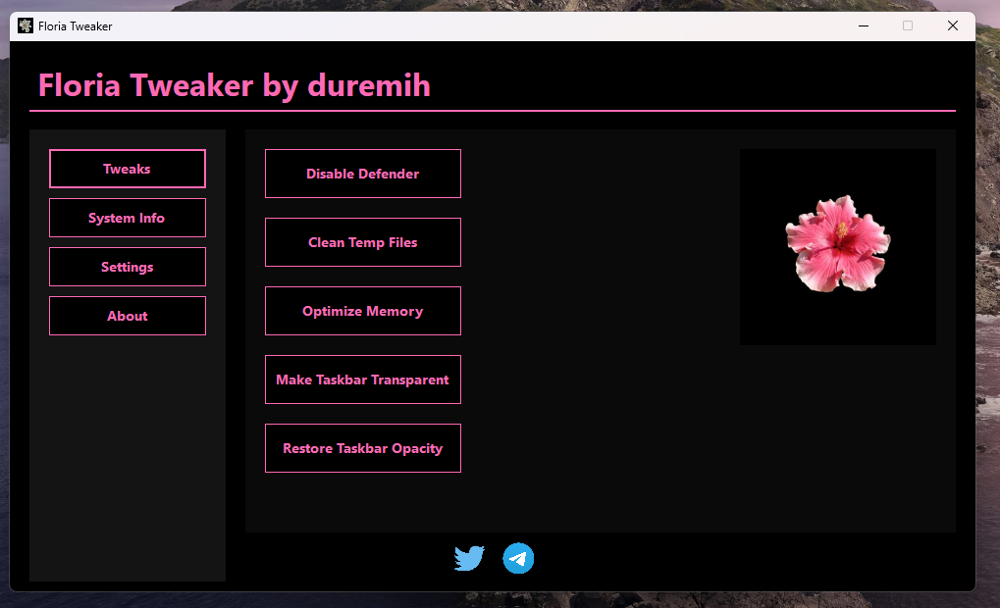
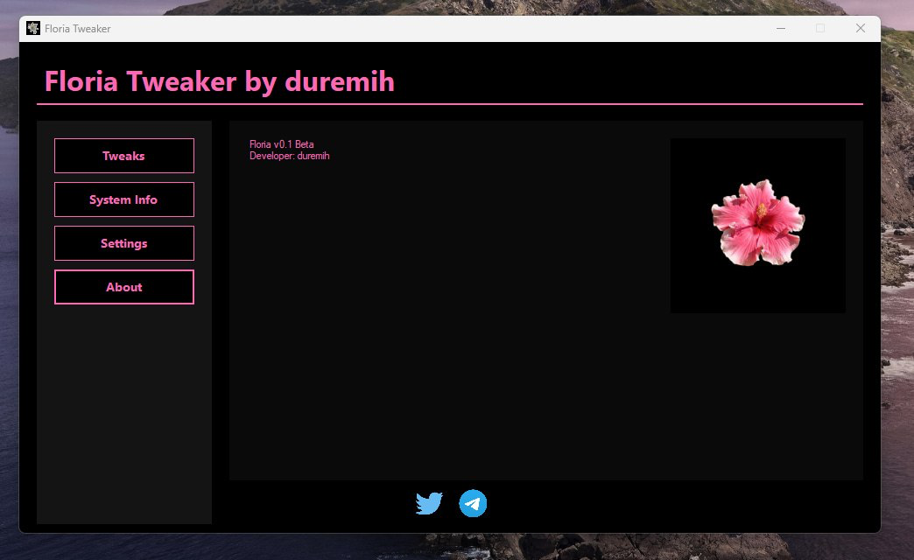

# Floria Tweaker

Floria Tweaker is a modern Windows tweaking and optimization tool with a sleek OLED-style interface. The program is designed for user convenience and includes a variety of useful tweaks and system information features.  

**Author:** duremih  
**Version:** Floria v0.1 Beta

---

## Features

- Elegant interface with **black OLED background** and **pink accents**  
- **Tweaks section**:
  - Disable Windows Defender real-time protection  
  - Clean temporary files  
  - Optimize memory  
  - Disable Windows animations  
  - Show hidden files  
  - Disable Windows telemetry  
  - Make taskbar transparent / restore opacity  
- **System Info**: Displays computer name, username, OS version, 64-bit status, processor count, and .NET version  
- **Settings**: Opens Windows system settings  
- **About**: Shows program and developer information  

---

## Screenshots

| Screenshot 1 | Screenshot 2 | Screenshot 3 |
|--------------|--------------|--------------|
|  |  |  |
